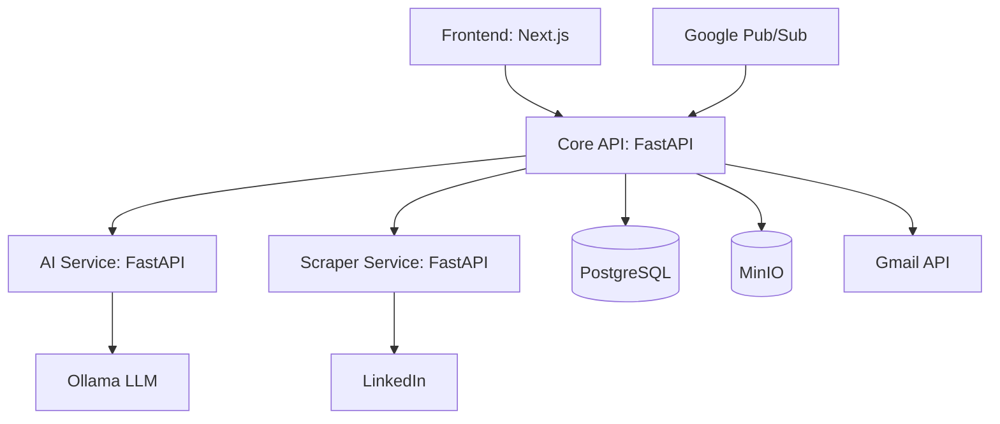
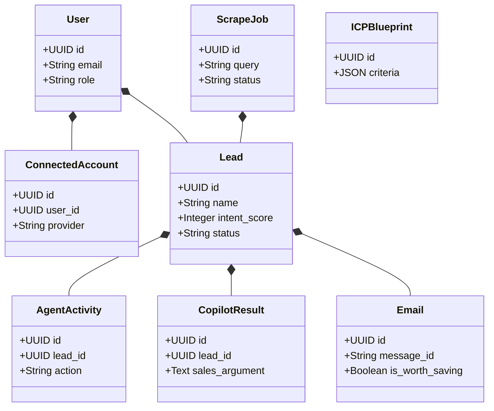
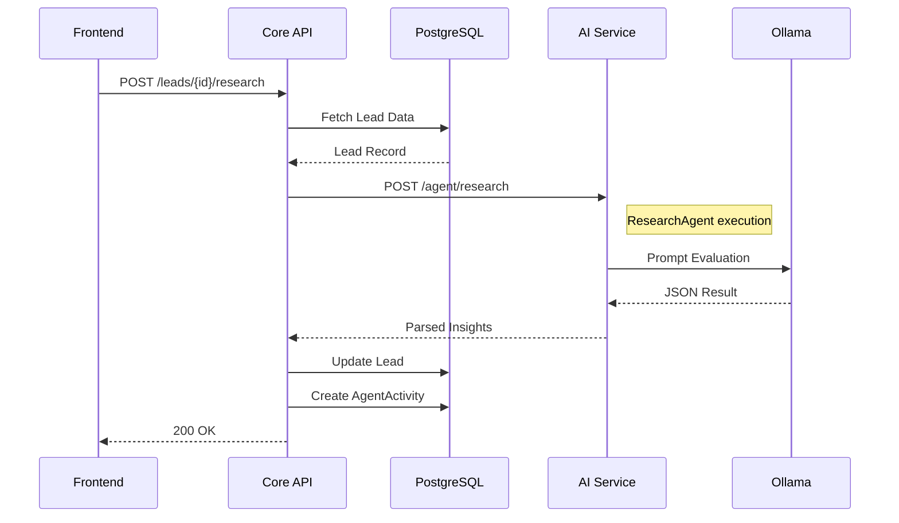
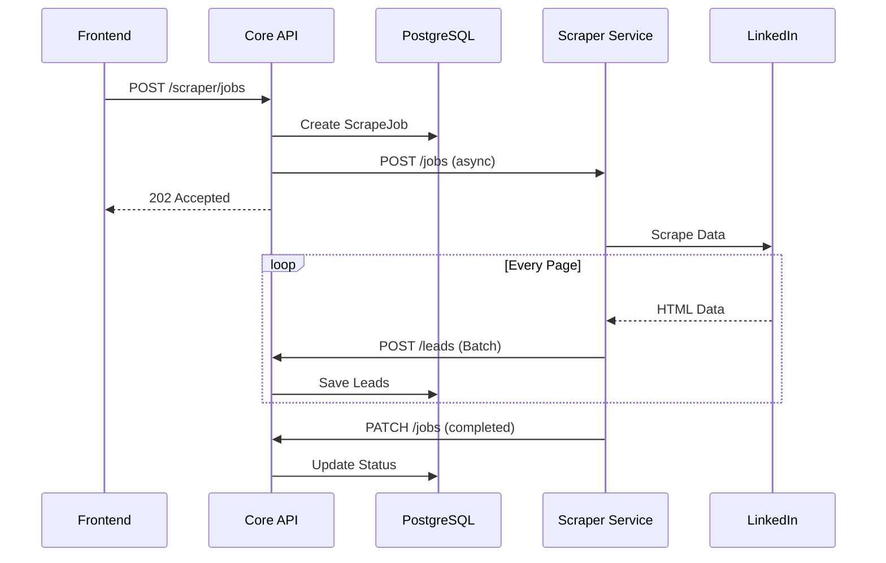
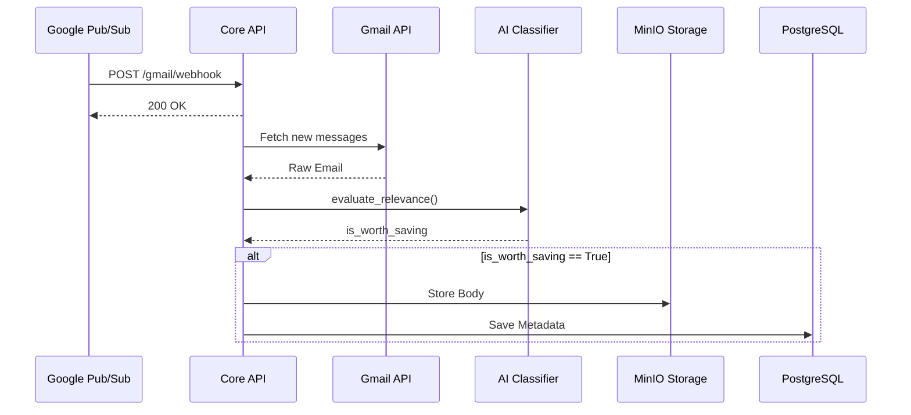

# CRM Agentic AI

Un CRM cu agenți AI care analizează lead-uri în timp real, calculează scorul de intenție și generează sugestii personalizate pentru vânzători.

Interfața are 3 coloane:
- **Activity Feed** — activitățile agenților AI în timp real
- **Intent Pipeline** — lead-urile sortate după scorul de intenție calculat de AI
- **Co-pilot Sidebar** — winning argument + draft mesaj personalizat per lead

---

## Funcționalități

- **Autentificare completă** — register, login/logout, verificare email, forgot/reset password
- **Lead Pipeline** — adaugă, vizualizează, șterge lead-uri; import CSV; scraper LinkedIn
- **4 Agenți AI:**
  - `LeadResearchAgent` — analizează profilul unui lead, extrage semnale de cumpărare, calculează scor de intenție 0–100 (pornit automat la crearea unui lead)
  - `CopilotAgent` — generează winning argument + draft email personalizat per lead (tier-based: HOT / WARM / COLD / LOST)
  - `SearchQueryAgent` — generează query-uri de căutare LinkedIn din ICP
  - `EmailClassifier` — clasifică emailuri primite prin Gmail
- **ICP Builder** — definești profilul clientului ideal în limbaj natural; AI-ul îl folosește la ranking
- **Gmail Integration** — conectare cont Google, monitorizare inbox prin Pub/Sub
- **Settings** — profil utilizator, conturi conectate, info platformă
- **Responsive** — funcționează pe mobile, tabletă și desktop
- **CI/CD** — GitHub Actions: lint → teste → build Docker → publish GHCR

---

## Pornire rapidă

### 1. Cerințe

**Windows / macOS**
- [Docker Desktop](https://www.docker.com/products/docker-desktop/) instalat și pornit

**Linux**
```bash
curl -fsSL https://get.docker.com | sh
sudo apt-get install -y docker-compose-plugin
sudo systemctl start docker
sudo usermod -aG docker $USER && newgrp docker
```

### 2. Clonează repo-ul

```bash
git clone https://github.com/vladinsc/-CRM-Agentic-AI.git
cd -CRM-Agentic-AI
```

### 3. Pornește serviciile

```bash
docker compose up -d
```

> Migrațiile bazei de date rulează automat la pornire.

### 4. Descarcă modelele AI (o singură dată)

```bash
docker exec crm-ollama ollama pull llama3.2:3b   # ~2GB — Research, Copilot, Email Classifier
docker exec crm-ollama ollama pull llama3.1:8b   # ~5GB — SearchQueryAgent
```

### 5. Accesează aplicația

| Serviciu | URL |
|---|---|
| Frontend | http://localhost:3000 |
| Core API (docs) | http://localhost:8000/docs |
| AI Service (docs) | http://localhost:8001/docs |
| MinIO Console | http://localhost:9001 |

---

## Stack

| Layer | Tehnologie |
|---|---|
| Frontend | Next.js 16 + React 19 + TypeScript + Tailwind CSS + shadcn/ui |
| Core API | FastAPI + SQLAlchemy + Alembic + PostgreSQL |
| AI Service | FastAPI + Ollama (llama3.2:3b / llama3.1:8b) |
| Scraper | FastAPI + Playwright |
| Infra | Docker Compose (8 containere) |
| CI/CD | GitHub Actions + GHCR |

---

## Comenzi utile

```bash
docker compose up --build          # rebuild și pornește tot
docker compose down                # oprește (păstrează volumele)
docker compose down -v             # oprește + șterge toate datele
docker compose logs core-api -f    # urmărește logurile unui serviciu

# Teste
cd core-api && python -m pytest tests/ -q
cd ai-service && python -m pytest tests/ -q
```

---

## System Architecture Diagrams

### 1. High-Level Architecture


### 2. Class Diagram (Data Models)


### 3. Lead Research Flow


### 4. LinkedIn Scraping Flow


### 5. Gmail Integration Flow

